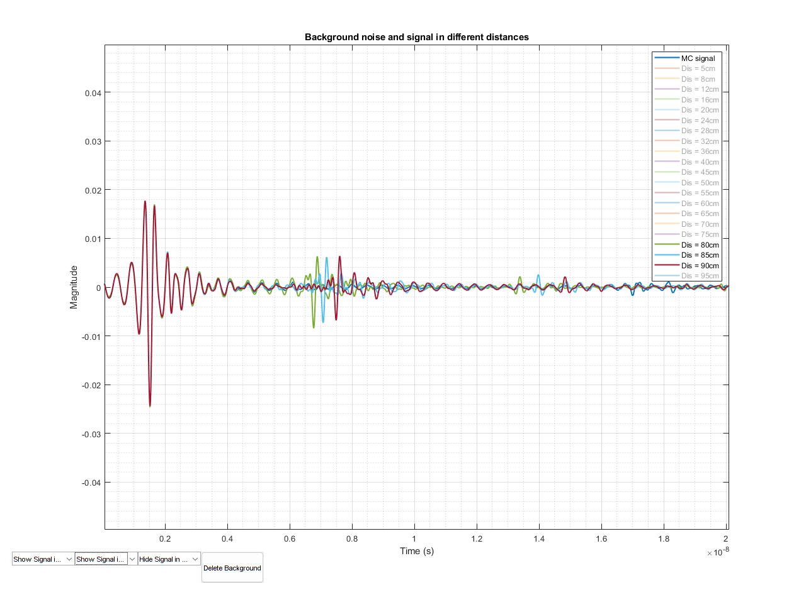
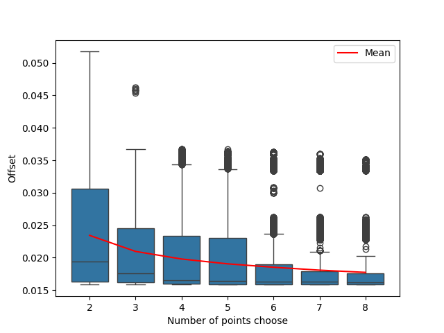

# VNA频域转时域信号零时刻校准

## 1. 介绍

本文档描述了如何使用VNA频域转时域信号，并计算系统延迟以进行0时刻校准。并最后实现一个端到端的0时刻校准的快速部署。

### 1.1 VNA频域转时域信号

VNA测量的是频域信号，即S参数。S参数是频率的函数，即$S(f)$，它由幅度$\alpha$和相位$
\phi$组成。S参数可以通过傅里叶反变换转换的思想为时域信号，即$s(t)$。其转换公式如下：

$$
s(t) = \sum_{i=0}^{i_{max}} S(f_i) \times \cos(2\pi f_i t + \phi_i)
$$

### 1.2 系统延迟的由来和反射信号在时域上的表现

在VNA测量时，由于各种因素，如电缆、连接器、滤波器等，会引入系统延迟。系统延迟会导致测量的信号在时间上产生偏移。为了消除这种偏移，需要进行0时刻校准。

VNA在进行空背景测量时，会得到互藕信号，我们成为`mc_signal`，在VNA前面特定距离放置金属板，会得到反射信号，我称为不同距离下的`singal`。对比`mc_signal` 和 `signal`，我们可以观察到在信号中，什么时间发生了反射。如下图：



如下图，观察在距离80cm, 85cm, 90cm三个不同距离下的信号，我们可以清晰的看到反射信号在时间上的偏移。，还有其他部分信号的高度重叠。因此，我们可以测算出反射信号在时间出现的时间`t2`，这个时间是由信号飞行时间`t1`和系统延迟`t0`组成的。

$$
t_2 = t_1 + t_0
$$

### 1.3 数据来源
因此，通过计算我们所设置的23个不同距离板子下，VNA S参数转化而成的时域信号，我们可以得到由信号决定的`t2`，由距离决定的`t1`，并通过关系计算出`t0`。我们得到了这样的数据记录共23条，我们也将通过这23条数据记录，分析如何高效和准确地计算出系统延迟以进行0时刻校准。

## 2. 零时刻校准

### 2.1 零时刻校准方法

1. 将VNA测量的S参数转化为时域信号，并计算他们的`t2`, `t1`, `t0`， 记录到表格中，如`./signal/time.xlsx`所示
2. 将time.xlsx中的数据，当作`dataset`,我们选择其中的一部分数据，作为`train_set`，得到它们的`t0`计入`t0_list`，然后通过`t0_list`构筑`t0_range`:

    ```python
    # t0_precision = 100
    t0_range = np.linspace(min(t0_list) * 0.95, max(t0_list) * 1.05, t0_precision)
    ```

3. 我们会在`train_set`上遍历`t0_range`，得到每个`t0`对应的`loss`，然后选择`loss`最小的`t0`作为最终的`t0`。

    其中，我们简单地以`train_set`上计算得到的`offest`的平均值为loss，即：
    $$
    loss = mean(\frac{\text{Distance}_\text{truth} - \text{Distance}_\text{predict}}{\text{Distance}_\text{truth}})
    $$

4. 然后我们会计算该`t0`在`dataset`上的`offest`，并将其作为最终的`offest`参考。

### 2.2 至少需要多少个数据才可以进行0时刻校准

为了探究了至少需要多少个数据才可以有效进行0时刻校准，我们从我们的数据中，从选择2个到选择8个，求出选择不同数据量的所有可能性，即进行$C_{23}^{n}$组合，然后计算出每种组合的平均`offset`。如下图：



我们可以看出，随着数据量选取的增大，`offset`的平均值逐渐减小，箱型图逐渐变小，说明数据量越大，0时刻校准的效果的稳定性会越好；同时，我们可以看出，当数据量达到4个时，`offset`的中位数已经几乎保持不变，平均值也下降缓慢。而且，通过查找最好的offset，在数据量为3时，我们对5cm, 70cm, 80cm这三个数据进行0时刻校准。

因此，在进行0时刻校准时，需要3个数据及以上可以有效和合理地进行0时刻校准，这三个距离数据可以反复测量得到，以保证0时刻校准的准确性。

## 3. 使用说明书

### 3.1 数据准备

使用你的VNA，在其面前放置金属板，测量不同距离下的S参数，文件命名为`n.csv`，其中n为距离，单位为cm。然后将这些文件放置到`./bin/data`文件夹下。再将金属板移开，测量背景噪声，互藕信号，文件命名为`MC.csv`，并放置到`./bin/data`文件夹下。

数据量至少要在3个以上，以保证0时刻校准的准确性。同时，数据量越多，0时刻校准的效果越稳定。本文档推荐为5个数据为最好的trade off。而且数据之间要有一定的距离差异为优。

以下为推荐的距离：
10cm, 20cm, 40cm, 60cm, 80cm

本仓库支持任意合理距离的部署。

### 3.2 准备环境

准备python环境，需要的依赖包：

```bash
pandas
numpy
seaborn
matplotlib
rich
```

### 3.3 运行

运行`./bin/main.py`，即可得到0时刻校准的结果，输出结果在`./bin/t.csv`

